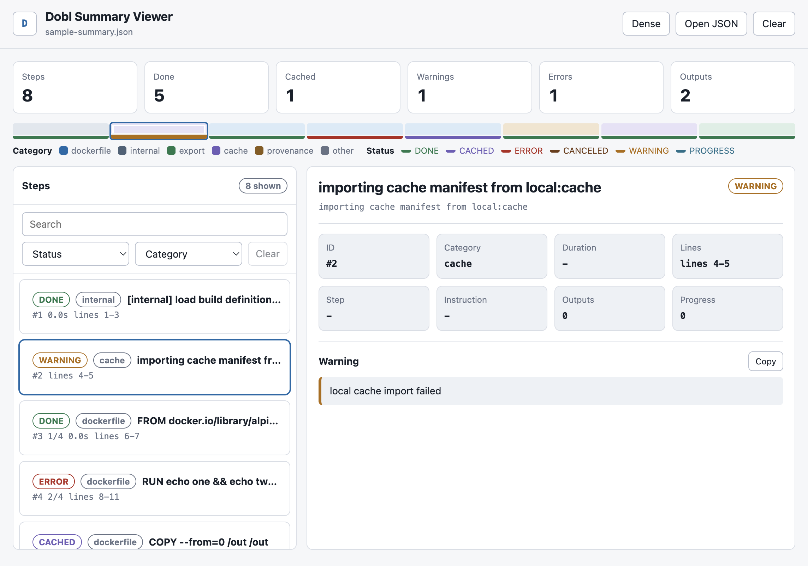

# Dobl Summary Viewer

`index.html` is a generated static viewer for `dobl summary --format json`
output. It has no build step and no external runtime dependencies.

The canonical viewer source is `internal/cli/viewer.html`, which is embedded by
`dobl report`. Regenerate this copy after editing the canonical viewer:

```sh
go generate ./internal/cli
```



Generate summary JSON:

```sh
dobl summary build.log > summary.json
```

Open `index.html` in a browser and load `summary.json`.

For local fixture data:

```sh
GOCACHE=/tmp/dobl-go-build go run ../../cmd/dobl summary ../../testdata/visualization_contract_plain.log > sample-summary.json
```

The checked-in `sample-summary.json` is generated from
`testdata/visualization_contract_plain.log`.
